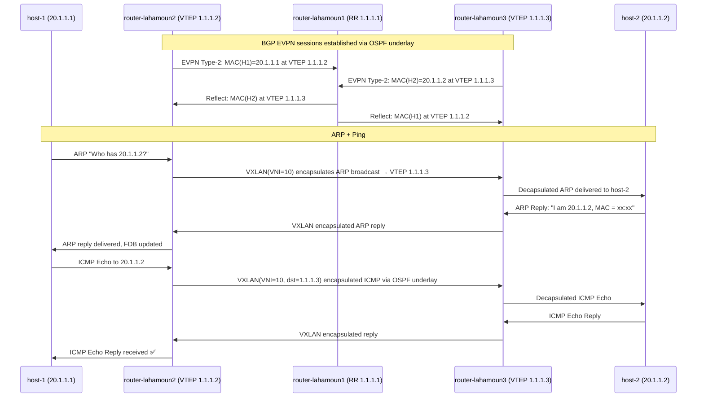
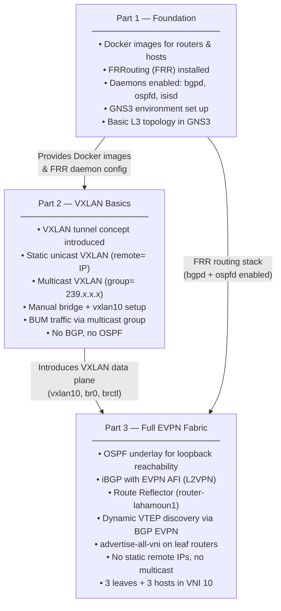

# BADASS Project 

### I tried to create a step-by-step README that takes a deep dive into BGP and explains Part 3 in detail
---


## Table of Contents

1. [What is Part 3 About?](#what-is-part-3-about)
2. [Topology Overview](#topology-overview)
3. [Network Components](#network-components)
4. [How It All Works — Step by Step](#how-it-all-works--step-by-step)
   - [Layer 1: OSPF — The IGP Underlay](#layer-1-ospf--the-igp-underlay)
   - [Layer 2: iBGP with EVPN — The Control Plane](#layer-2-ibgp-with-evpn--the-control-plane)
   - [Layer 3: VXLAN — The Data Plane Overlay](#layer-3-vxlan--the-data-plane-overlay)
5. [Configuration Breakdown](#configuration-breakdown)
   - [router 1 — Route Reflector](#router-lahamoun1--route-reflector)
   - [router 2— VTEP Leaf](#router-lahamoun2--vtep-leaf)
   - [router 3 — VTEP Leaf](#router-lahamoun3--vtep-leaf)
   - [router 4 — VTEP Leaf](#router-lahamoun4--vtep-leaf)
   - [host-1, host-2, host-3](#host-1-host-2-host-3)
6. [Packet Walk: host-1 pings host-2](#packet-walk-host-1-pings-host-2)
7. [Key Concepts Glossary](#key-concepts-glossary)

---

## What is Part 3 About?

Part 3 is the **culmination of the entire BGP project**. It implements a **full EVPN/VXLAN fabric** the same technology used in modern data centers by companies like Facebook, Google, and Amazon to stretch Layer 2 networks across physically separate servers.

The core idea: **three hosts on the same `/24` subnet (`20.1.1.0/24`) appear to be on the same LAN, even though they are physically connected to three different routers**. The routers create a virtual tunnel network (VXLAN) and use BGP EVPN to dynamically learn and distribute MAC/IP information — no static configuration, no multicast groups needed.

| Concept | P1 | P2 | P3 |
|---|---|---|---|
| Docker + FRR environment | ✅ Built | ✅ Reused | ✅ Reused |
| VXLAN tunnels | ❌ | ✅ Static/Multicast | ✅ **Dynamic via BGP EVPN** |
| BGP control plane | ❌ | ❌ | ✅ iBGP + EVPN AFI |
| OSPF underlay | ❌ | ❌ | ✅ Loopback reachability |
| Route Reflector | ❌ | ❌ | ✅ |

---

## Topology Overview

```
                    ┌─────────────────────┐
                    │   router-lahamoun1  │
                    │   (Route Reflector) │
                    │   lo: 1.1.1.1/32    │
                    │   eth0: 10.1.1.1/30 │  ←──── connects to R2
                    │   eth1: 10.1.1.5/30 │  ←──── connects to R3
                    │   eth2: 10.1.1.9/30 │  ←──── connects to R4
                    └──────────┬──────────┘
                   iBGP RR     │     iBGP RR
          ┌────────────────────┼──────────────────┐
          │                   │                  │
          ▼                   ▼                  ▼
┌─────────────────┐ ┌─────────────────┐ ┌─────────────────┐
│router-lahamoun2 │ │router-lahamoun3 │ │router-lahamoun4 │
│ VTEP (Leaf)     │ │ VTEP (Leaf)     │ │ VTEP (Leaf)     │
│ lo: 1.1.1.2/32  │ │ lo: 1.1.1.3/32  │ │ lo: 1.1.1.4/32  │
│ eth0: 10.1.1.2  │ │ eth1: 10.1.1.6  │ │ eth2: 10.1.1.10 │
│ br0 + vxlan10   │ │ br0 + vxlan10   │ │ br0 + vxlan10   │
└────────┬────────┘ └────────┬────────┘ └────────┬────────┘
         │ (eth1 → br0)      │ (eth0 → br0)      │ (eth0 → br0)
         ▼                   ▼                   ▼
      host-1              host-2              host-3
   20.1.1.1/24         20.1.1.2/24         20.1.1.3/24
```

---

## Network Components

### Routers

| Router | Loopback | Uplink IP | Role |
|---|---|---|---|
| `router-lahamoun1` | `1.1.1.1/32` | eth0:`10.1.1.1/30`, eth1:`10.1.1.5/30`, eth2:`10.1.1.9/30` | **iBGP Route Reflector** (spine) |
| `router-lahamoun2` | `1.1.1.2/32` | eth0:`10.1.1.2/30` | **VTEP Leaf** — serves host-1 |
| `router-lahamoun3` | `1.1.1.3/32` | eth1:`10.1.1.6/30` | **VTEP Leaf** — serves host-2 |
| `router-lahamoun4` | `1.1.1.4/32` | eth2:`10.1.1.10/30` | **VTEP Leaf** — serves host-3 |

### Hosts

| Host | IP Address | Connected via |
|---|---|---|
| `host-1` | `20.1.1.1/24` | `eth1` → bridge `br0` on R2 |
| `host-2` | `20.1.1.2/24` | `eth0` → bridge `br0` on R3 |
| `host-3` | `20.1.1.3/24` | `eth0` → bridge `br0` on R4 |

---

## How It All Works

The architecture has **three distinct layers**, each serving a specific role:

### Layer 1: OSPF — The IGP Underlay

**Problem:** The VTEP routers (R2, R3, R4) need to reach each other's **loopback addresses** to form VXLAN tunnels and BGP sessions. But they are only directly connected to R1, not to each other.

**Solution:** OSPF Area 0 runs on all physical interfaces (eth0/eth1/eth2) and on the loopback interfaces of all four routers. OSPF advertises the loopbacks into the routing table so that:
- `1.1.1.2`, `1.1.1.3`, `1.1.1.4` are all reachable from everywhere
- BGP sessions can be established between R1 and each leaf using loopbacks (stable, not tied to a physical link)

```
# All routers run:
router ospf
# All interfaces (including loopbacks) have:
ip ospf area 0
```

This is the **physical underlay** the real IP network that carries all tunneled traffic.

---

### Layer 2: iBGP with EVPN: The Control Plane

**Problemm:** When a host sends a packet, the VTEP router learn the host's MAC address. How does R3 and R4 know that `20.1.1.1` lives at R2 (VTEP `1.1.1.2`)? In P2, this was done with static config or multicast. In P3, it's done **dynamically**.

**Solution:** BGP EVPN (Address Family L2VPN EVPN) is used. Each leaf router:
1. Learns local MACs/IPs from its bridge (`br0`)
2. Advertises them as **EVPN Type-2 routes** (MAC/IP Advertisement) to R1
3. R1, acting as a **Route Reflector**, re-advertises these routes to all other leaves
4. Each leaf installs the remote MAC-to-VTEP-IP mappings in its VXLAN forwarding database (FDB)

**Why a Route Reflector?**
In a full iBGP mesh, every router must peer with every other router that's O(n²) sessions. With a Route Reflector (R1), each leaf only needs **one BGP session** (to R1), and R1 redistributes everything. Much more scalable.

```
# On R1 (Route Reflector):
router bgp 1
  neighbor ibgp peer-group
  neighbor ibgp remote-as 1
  neighbor ibgp update-source lo
  bgp listen range 1.1.1.0/29 peer-group ibgp   # Auto-accepts any leaf in this range
  address-family l2vpn evpn
    neighbor ibgp activate
    neighbor ibgp route-reflector-client          # R1 reflects routes between leaves

# On R2/R3/R4 (Leaves):
router bgp 1
  neighbor 1.1.1.1 remote-as 1                   # Point to R1 loopback
  neighbor 1.1.1.1 update-source lo              # Use own loopback as source
  address-family l2vpn evpn
    neighbor 1.1.1.1 activate
    advertise-all-vni                             # Advertise all local VNIs via BGP EVPN
```

---

### Layer 3: VXLAN The Data Plane Overlay

**Problem:** Hosts on different physical routers need to think they're on the same Layer 2 segment. Ethernet frames from `host-1` (on R2) need to reach `host-2` (on R3) transparently.

**Solution:** Each leaf router creates a **VXLAN tunnel interface** (`vxlan10`) with VNI (VXLAN Network Identifier) `10`. This VTEP (VXLAN Tunnel Endpoint) encapsulates Ethernet frames in UDP/IP packets and sends them across the OSPF underlay.

The bridge (`br0`) ties everything together locally:
- The host's physical port (`eth0` or `eth1`) connects to `br0`
- The `vxlan10` tunnel also connects to `br0`
- Any frame arriving on one port is flooded/forwarded to the other

```bash
# On each leaf (R2, R3, R4):
ip link add br0 type bridge          # Create Layer 2 bridge
ip link set dev br0 up

ip link add vxlan10 type vxlan \
  id 10 \                            # VNI = 10 (the virtual network ID)
  dstport 4789                       # Standard VXLAN UDP port (IANA assigned)
ip link set dev vxlan10 up

brctl addif br0 vxlan10              # Add VXLAN tunnel to bridge
brctl addif br0 eth0 (or eth1)       # Add host-facing port to bridge
```

> [!IMPORTANT]
> Unlike P2 where VXLAN used **static remote IPs** or a **multicast group** for BUM (Broadcast, Unknown, Multicast) traffic, in P3 there is **no `remote` or `group` keyword** in the vxlan command. The destination VTEPs are learned **dynamically via BGP EVPN**. FRR's zebra daemon programs the VXLAN FDB automatically based on BGP EVPN routes.

---

## Configuration Breakdown 

This is the **spine router**. It has no bridge or VXLAN  it only runs the routing protocols.

```bash
# Three physical links to the three leaves
interface eth0
 ip address 10.1.1.1/30
 ip ospf area 0

interface eth1
 ip address 10.1.1.5/30
 ip ospf area 0

interface eth2
 ip address 10.1.1.9/30
 ip ospf area 0

# Loopback — used as stable BGP session endpoint
interface lo
 ip address 1.1.1.1/32
 ip ospf area 0

# BGP AS 1 — iBGP Route Reflector
router bgp 1
 neighbor ibgp peer-group           # Named peer group for all leaves
 neighbor ibgp remote-as 1          # Same AS = iBGP
 neighbor ibgp update-source lo     # Sessions sourced from loopback

 # Dynamic listener: any router with loopback in 1.1.1.0/29 can join
 bgp listen range 1.1.1.0/29 peer-group ibgp

 address-family l2vpn evpn
   neighbor ibgp activate
   neighbor ibgp route-reflector-client  # Reflect EVPN routes between leaves

router ospf                         # OSPF enabled (interfaces autoconfigured)
```

**Key design decisions:**
- `bgp listen range` is elegant  no need to manually list each leaf. Any new leaf with a loopback in `1.1.1.0/29` auto-connects.
- `update-source lo` ensures BGP sessions survive link flaps on any single physical interface.
- `route-reflector-client` on R1 means it will reflect routes received from one leaf to all other leaves.

---

### Router 2 — VTEP Leaf

Serves `host-1` (`20.1.1.1`). Has a VXLAN bridge and connects to R1 via `eth0`.

```bash
# --- Linux kernel setup (before vtysh) ---
ip link add br0 type bridge
ip link set dev br0 up
ip link add vxlan10 type vxlan id 10 dstport 4789   # No remote/group = BGP-controlled
ip link set dev vxlan10 up
brctl addif br0 vxlan10             # VXLAN in bridge
brctl addif br0 eth1                # host-1 is on eth1

# --- FRR (vtysh) ---
interface eth0
 ip address 10.1.1.2/30            # Uplink to R1
 ip ospf area 0

interface lo
 ip address 1.1.1.2/32             # BGP session endpoint
 ip ospf area 0

router bgp 1
 neighbor 1.1.1.1 remote-as 1      # Peer with R1 (Route Reflector)
 neighbor 1.1.1.1 update-source lo

 address-family l2vpn evpn
   neighbor 1.1.1.1 activate
   advertise-all-vni               # Tell BGP to advertise VNI 10 info

router ospf
```

---

### Router 3

Serves `host-2` (`20.1.1.2`). Connects to R1 via `eth1`. Host is on `eth0` → bridge.

```bash
# Bridge + VXLAN
ip link add br0 type bridge
ip link set dev br0 up
ip link add vxlan10 type vxlan id 10 dstport 4789
ip link set dev vxlan10 up
brctl addif br0 vxlan10
brctl addif br0 eth0               # host-2 on eth0

# FRR
interface eth1
 ip address 10.1.1.6/30            # Uplink to R1
 ip ospf area 0

interface lo
 ip address 1.1.1.3/32
 ip ospf area 0

router bgp 1
 neighbor 1.1.1.1 remote-as 1
 neighbor 1.1.1.1 update-source lo

 address-family l2vpn evpn
   neighbor 1.1.1.1 activate
   advertise-all-vni

router ospf
```

---

### Router 4

Serves `host-3` (`20.1.1.3`). Connects to R1 via `eth2`. Host is on `eth0` → bridge.

```bash
# Bridge + VXLAN
ip link add br0 type bridge
ip link set dev br0 up
ip link add vxlan10 type vxlan id 10 dstport 4789
ip link set dev vxlan10 up
brctl addif br0 vxlan10
brctl addif br0 eth0               # host-3 on eth0

# FRR
interface eth2
 ip address 10.1.1.10/30           # Uplink to R1
 ip ospf area 0

interface lo
 ip address 1.1.1.4/32
 ip ospf area 0

router bgp 1
 neighbor 1.1.1.1 remote-as 1
 neighbor 1.1.1.1 update-source lo

 address-family l2vpn evpn
   neighbor 1.1.1.1 activate
   advertise-all-vni

router ospf
```

---

### [`host-1`](file:///home/elitesec/Desktop/BGP/P3/host-1), [`host-2`](file:///home/elitesec/Desktop/BGP/P3/host-2), [`host-3`](file:///home/elitesec/Desktop/BGP/P3/host-3)

Hosts are dead simple they just get an IP on their interface. They have **no idea** they're in a VXLAN overlay:

```bash
# host-1
ip addr add 20.1.1.1/24 dev eth1

# host-2
ip addr add 20.1.1.2/24 dev eth0

# host-3
ip addr add 20.1.1.3/24 dev eth0
```

This is the beauty of overlay networking  the end hosts see a flat Layer 2 network and need zero special configuration.

---

## Packet Walk: host-1 pings host-2

Here's what actually happens when `host-1` (`20.1.1.1`) sends a ping to `host-2` (`20.1.1.2`):



---


The three parts build progressively on top of each other:




---
## Key Concepts Glossary

| Term | Meaning |
|---|---|
| **VTEP** | VXLAN Tunnel Endpoint: the router that encapsulates/decapsulates VXLAN frames |
| **VNI** | VXLAN Network Identifier: the virtual network ID (like a VLAN ID, but 24-bit) |
| **EVPN** | Ethernet VPN: a BGP address family that carries MAC/IP reachability info |
| **Route Reflector** | A BGP router that reflects routes between iBGP peers, avoiding full mesh |
| **Loopback** | A virtual interface that stays "up" regardless of physical link state — ideal for BGP |
| **OSPF Area 0** | The backbone area in OSPF  all routers here share full link-state topology |
| **L2VPN EVPN AFI** | The BGP address family (`address-family l2vpn evpn`) used for EVPN routes |
| **advertise-all-vni** | FRR directive to automatically advertise all locally configured VNIs into BGP EVPN |
| **peer-group** | A BGP config group applied to multiple neighbors at once |
| **bgp listen range** | Allows R1 to dynamically accept BGP connections from any IP in a given prefix |
| **FDB** | Forwarding Database the VXLAN bridge table mapping MACs to remote VTEP IPs |
| **BUM traffic** | Broadcast, Unknown-unicast, Multicast  handled via EVPN Type-3 routes in P3 |
